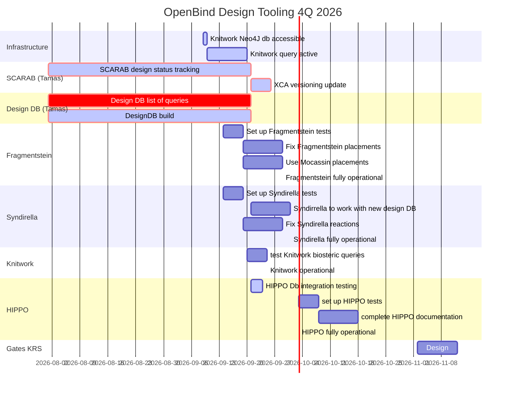

```mermaid
gantt
dateFormat  YYYY-MM-DD
title OpenBind Design Tooling 4Q 2026

section Infrastructure
Knitwork Neo4J db accessible        :active,        I1,    2026-09-09,  2026-09-10
Knitwork query active               :active,        I2,    2026-09-10,  10d


section SCARAB (Tamas)
SCARAB design status tracking   :crit, active,      SC1,    2026-08-01, 2026-09-21
XCA versioning update          :crit, active,       XCAV,   after SC1,  5d


section Design DB (Tamas)
Design DB list of queries       :crit,          DB2,         2026-08-01, 2026-09-21
DesignDB build                  :crit, active,  DB1,        2026-08-01, 2026-09-21

section Fragmentstein
Set up Fragmentstein tests      :               F1,         2026-09-14, 5d
Fix Fragmentstein placements    :               F2,         after F1,   10d
Use Mocassin placements    :               F2,         after F1,   10d             
Fragmentstein fully operational :milestone      F3,         after F2,  0d


section Syndirella
Set up Syndirella tests      :               Sy1,         2026-09-14, 5d
Syndirrella to work with new design DB:    Sy4,          after DB1, 10d
Fix Syndirella reactions    :               Sy2,         after Sy1,   10d            
Syndirella fully operational :milestone      Sy3,         after Sy4,  0d


section Knitwork
test Knitwork biosteric queries :             K1,           after I2,   5d
Knitwork operational            : milestone   K2,           after K1,   0d

section HIPPO
HIPPO Db integration testing  :active,        H1,         after DB1,  3d
set up HIPPO tests            :               H2,         after K2,   5d
complete HIPPO documentation  :               H3,         after H2,   10d            
HIPPO fully operational       :milestone      H5,         after Sy3,   0d

section Gates KRS
Design                        :               G1,         2026-11-02, 10d
```